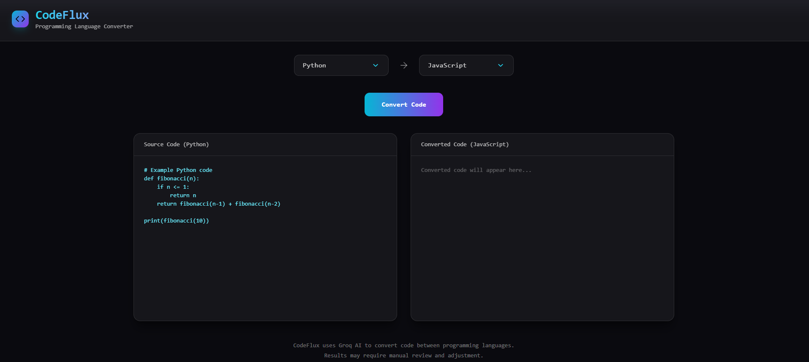

# 🚀 CodeFlux

CodeFlux is a modern full-stack AI-powered programming language
converter.\
It allows users to convert source code between multiple programming
languages using LLM APIs.

------------------------------------------------------------------------

## 🌐 Live Demo

🔗 Frontend (Vercel):\
https://code-flux-bysush.vercel.app/

🔗 Backend (Render):\
https://codeflux-dlw6.onrender.com/

------------------------------------------------------------------------

## 🖼 Preview



------------------------------------------------------------------------

## 🧠 Features

-   🔄 Convert code between 25+ programming languages
-   ⚡ Fast AI-powered backend (Groq API)
-   🎨 Modern glassmorphism UI
-   🌍 Multi-language UI support (EN / ES)
-   🔐 Secure backend with environment variables
-   📦 Full-stack deployment (Vercel + Render)

------------------------------------------------------------------------

## 🏗 Tech Stack

### Frontend

-   React (Vite)
-   Tailwind CSS
-   Lucide Icons
-   Glassmorphism UI design

### Backend

-   Node.js
-   Express
-   Groq SDK (LLM API)
-   dotenv

### Deployment

-   Vercel (Frontend)
-   Render (Backend)

------------------------------------------------------------------------

## 📂 Project Structure

    CodeFlux/
    │
    ├── CodeFlux-Frontend/
    │   ├── src/
    │   └── ...
    │
    ├── CodeFlux-Backend/
    │   ├── server.js
    │   └── ...
    │
    └── README.md

------------------------------------------------------------------------

## ⚙️ Local Setup

### 1️⃣ Clone the repo

``` bash
git clone https://github.com/Susmithay08/CodeFlux.git
cd CodeFlux
```

------------------------------------------------------------------------

### 2️⃣ Backend Setup

``` bash
cd CodeFlux-Backend
npm install
```

Create `.env`:

    GROQ_API_KEY=your_api_key_here

Run backend:

``` bash
node server.js
```

------------------------------------------------------------------------

### 3️⃣ Frontend Setup

``` bash
cd CodeFlux-Frontend
npm install
npm run dev
```

------------------------------------------------------------------------

## 📌 Future Improvements

-   Usage quota tracking UI
-   Copy-to-clipboard button
-   Syntax highlighting
-   Model selector
-   Authentication
-   Usage analytics

------------------------------------------------------------------------

## 👨‍💻 Author

Built by **Susmitha**

------------------------------------------------------------------------

## ⭐ If you like this project

Give it a star on GitHub!
